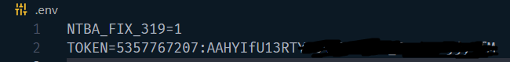
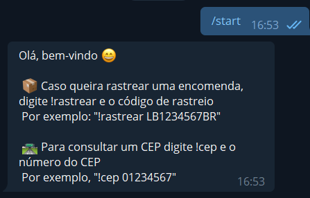
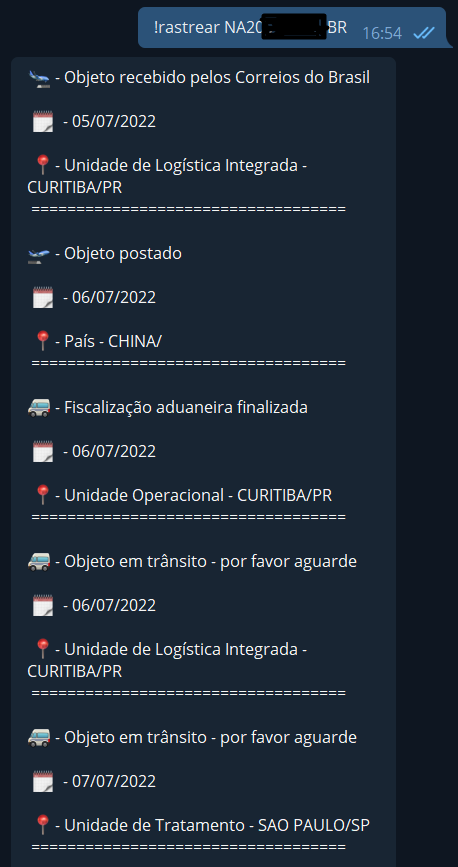
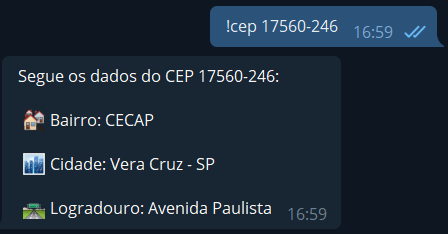

# Rastreador de Encomendas

Projeto feito para fins de estudos, é um bot do telegram, onde o usuario pode
colocar seu código de rastreio (Correios) e irá trazer os dados. Também poderá consutlar o CEP.

### 🛠 Tecnologias

As seguintes ferramentas foram usadas na construção do projeto:

- [Node.js](https://nodejs.org/en/)
- [TypeScript](https://www.typescriptlang.org/)

---

<br>

## ⚠️ Informação importante

Por motivos de este projeto ser somente para fins de estudo, ele não está em um servidor, caso queira rodar localmente você irá precisar criar seu próprio bot no telegram e pegar o token, é bem simples:

- No telegram procure por [@BotFahter](https://t.me/BotFather)
- Digite /start e logo após /newbot
- Poderá dar o nome que quiser
- Logo após isso ele disponibilizará um token
- "Use this token to access the HTTP API: xxxxxxxx"
- Crie um arquivo .env
- Pegue esse token e coloque no arquivo .env TOKEN=SEUTOKEN, "process.env.TOKEN" em app.ts, exemplo:
 
- * IMPORTANTE: MANTER O 'NTBA_FIX_319=1' NO ARQUIVO .ENV
  

<br>

## 💻 Demonstração

Para iniciar o bot digite /start
<br>

<br>

<br>


--- 

<br>

### Pré-requisitos

Antes de começar, você vai precisar ter instalado em sua máquina as seguintes ferramentas:
[Git](https://git-scm.com), [Node.js](https://nodejs.org/en/). 
Além disto é bom ter um editor para trabalhar com o código como [VSCode](https://code.visualstudio.com/)

---

<br>

### 🔧 Instalação

- Instalando as dependências:

```
yarn
```
ou
```
npm install
```

- Para rodar o projeto:

```
yarn dev
```

<br>

## 🛠️ Construído com

Mencione as ferramentas que você usou para criar seu projeto

* [correios-brasil](https://www.npmjs.com/package/correios-brasil) - API usada para trazer informações tanto da encomenda como do CEP
* [node-telegram-bot-api](https://www.npmjs.com/package/node-telegram-bot-api) - API usada para fazer a comunicação com o bot do telegram

## 📝 Licença

Este projeto esta sobe a licença [MIT](./LICENSE).

### ✒️ Autor

 
 <br />
 <sub><b>Luis Gustavo</b></sub>


Feito por Luis Gustavo 👋🏽 Entre em contato!

[](https://www.linkedin.com/in/luisgustavoterrinha/) 
[](mailto:luis93667@gmail.com)

---

<br>

